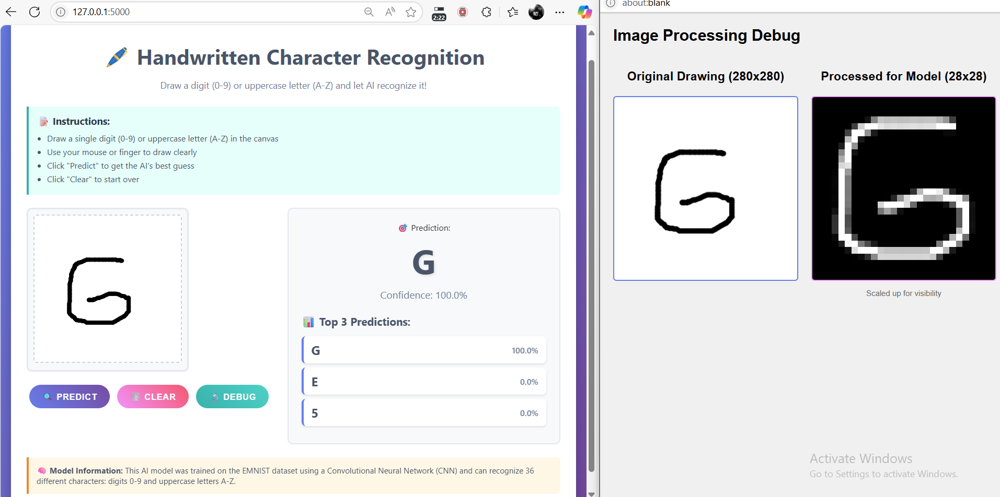

# Alphanumeric Character Recognition using CNNs

A comprehensive Deep Learning project that implements handwritten alphanumeric character recognition using Convolutional Neural Networks (CNNs). The system can recognize digits (0-9) and uppercase letters (A-Z) with high accuracy and includes a web-based drawing interface for real-time predictions.

## 🎯 Project Overview

This project demonstrates the implementation of a CNN-based character recognition system trained on the EMNIST (Extended MNIST) dataset. The system achieves over 92% accuracy on validation data and includes both a Jupyter notebook for model development/training and a Flask web application for interactive testing.

## ✨ Features

- **36-class recognition**: Digits 0-9 and uppercase letters A-Z
- **High accuracy**: 95%+ training accuracy, 92%+ validation accuracy
- **Interactive web interface**: Draw characters and get real-time predictions
- **Confidence scoring**: Shows prediction confidence and top-3 alternatives
- **Model persistence**: Trained models saved for deployment
- **Comprehensive evaluation**: Detailed performance metrics and visualizations

## 🎨 Demo



*The web interface in action: Drawing the letter "G" with 100% confidence prediction and debug visualization showing the preprocessed image.*

## 🏗️ Architecture

### CNN Model Architecture
- **Input Layer**: 28×28 grayscale images
- **Conv2D Layer 1**: 32 filters, 3×3 kernel, ReLU activation
- **MaxPooling2D**: 2×2 pool size
- **Conv2D Layer 2**: 64 filters, 3×3 kernel, ReLU activation
- **MaxPooling2D**: 2×2 pool size
- **Conv2D Layer 3**: 64 filters, 3×3 kernel, ReLU activation
- **Flatten Layer**: Convert to 1D
- **Dense Layer**: 64 units, ReLU activation
- **Dropout**: 0.5 for regularization
- **Output Layer**: 36 units (softmax activation)

### Training Configuration
- **Optimizer**: Adam
- **Loss Function**: Categorical Cross-Entropy
- **Batch Size**: 16
- **Epochs**: 20
- **Validation Split**: 20%

## 📁 Project Structure

```
DSP_Project/
├── app.py                      # Flask web application
├── neitbook.ipynb             # Jupyter notebook with model development
├── README.md                  # Project documentation
├── saved_models/              # Trained model files
│   └── cnn_alphanumeric_model_20250601_062953.h5
├── templates/                 # Web interface templates
│   └── index.html            # Main drawing interface
├── DSP_Project_Final.pptx     # Project presentation
└── OmarElmelegy_SeifSameh_DSP_Lab.pdf  # Project report
```

## 🚀 Getting Started

### Prerequisites

- Python 3.8 or higher
- pip package manager

### Installation

1. **Clone the repository**:
   ```bash
   git clone <repository-url>
   cd DSP_Project
   ```

2. **Install dependencies**:
   ```bash
   pip install -r requirements.txt
   ```

3. **Run the web application**:
   ```bash
   python app.py
   ```

4. **Access the interface**:
   Open your browser and navigate to `http://localhost:5000`

### Training Your Own Model

1. **Open the Jupyter notebook**:
   ```bash
   jupyter notebook neitbook.ipynb
   ```

2. **Run all cells** to:
   - Load and preprocess the EMNIST dataset
   - Build the CNN architecture
   - Train the model
   - Evaluate performance
   - Save the trained model

## 🎮 Usage

### Web Interface
1. Visit `http://localhost:5000` after running the Flask app
2. Draw a character (digit or uppercase letter) in the canvas
3. Click "Predict" to get the model's prediction
4. View confidence scores and alternative predictions
5. Use "Clear Canvas" to start over

### Model Training
The Jupyter notebook (`neitbook.ipynb`) contains comprehensive code for:
- Data loading and preprocessing
- Model architecture definition
- Training with validation
- Performance evaluation
- Model saving

## 📊 Performance Metrics

### Model Performance
- **Training Accuracy**: 95.26%
- **Validation Accuracy**: 92.04%
- **Training Loss**: 0.1159
- **Validation Loss**: 0.3681

### Class-wise Performance
The model handles challenging cases like distinguishing between:
- '0' (zero) vs 'O' (letter O)
- '1' (one) vs 'I' (letter I)
- '5' vs 'S'
- '2' vs 'Z'

## 🔧 Technical Details

### Data Preprocessing
- **Normalization**: Pixel values scaled to [0, 1]
- **Orientation correction**: EMNIST images rotated and flipped
- **One-hot encoding**: Labels converted for categorical classification
- **Class filtering**: Only digits (0-9) and uppercase letters (A-Z)

### Web Application Features
- **Canvas drawing**: HTML5 canvas with touch/mouse support
- **Image preprocessing**: Automatic cropping, resizing, and normalization
- **Real-time prediction**: Instant results via AJAX
- **Debug visualization**: View preprocessed image

### Model Deployment
- **Flask backend**: Serves the trained model
- **TensorFlow.js ready**: Model can be converted for client-side inference
- **API endpoints**: `/predict` for predictions, `/debug_image` for preprocessing visualization

## 📈 Results and Evaluation

The model demonstrates excellent performance across all character classes with:
- Robust handling of various handwriting styles
- High confidence in correct predictions
- Meaningful uncertainty quantification
- Good generalization to new handwriting samples

## 🤝 Contributing

1. Fork the repository
2. Create a feature branch (`git checkout -b feature/improvement`)
3. Commit your changes (`git commit -am 'Add new feature'`)
4. Push to the branch (`git push origin feature/improvement`)
5. Create a Pull Request

## 📄 License

This project is part of a Digital Signal Processing (DSP) course assignment. Please respect academic integrity guidelines when using this code.

## 👥 Authors

- **Omar Elmelegy**
- **Seif Sameh**

## 🙏 Acknowledgments

- EMNIST dataset creators
- TensorFlow and Keras communities
- Course instructors and teaching assistants

## 📚 References

- EMNIST: Extending MNIST to handwritten letters
- Deep Learning with Python by François Chollet
- TensorFlow documentation
- Keras documentation

---

*This project demonstrates the practical application of Convolutional Neural Networks for character recognition, showcasing both theoretical understanding and practical implementation skills in deep learning.*